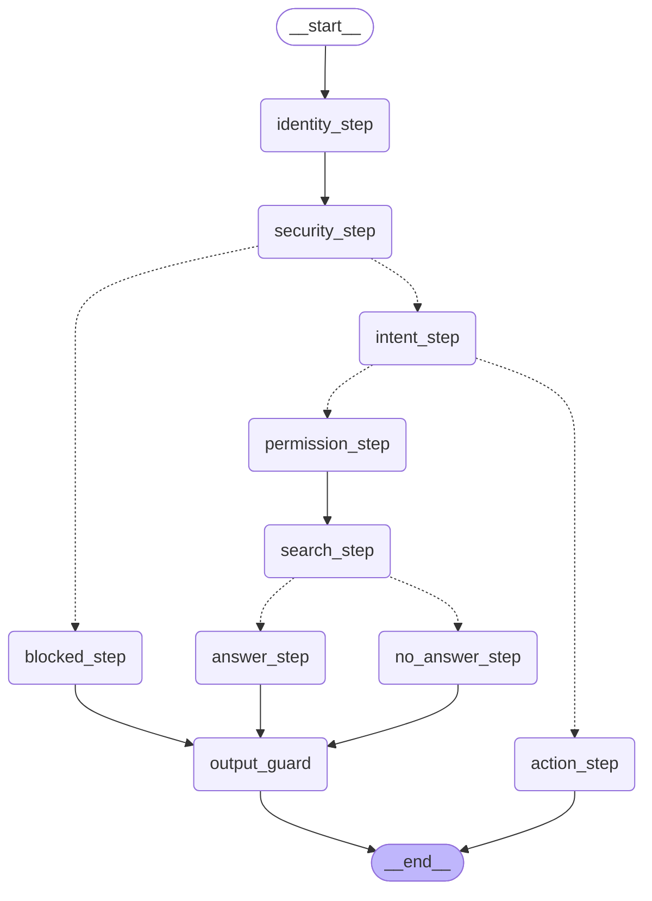

# Корпоративный AI-ассистент

Учебный проект: внутренний помощник компании, который отвечает на вопросы
по документам, соблюдает права доступа и выполняет действия только с
подтверждением человека.

Написан на **Python + FastAPI**.

## Зачем этот проект

Это не «чат с GPT по документам». Проект показывает инженерные вещи,
которые отличают безопасного корпоративного ассистента от простой обёртки
над языковой моделью:

1. **Умный поиск по смыслу.** Эмбеддинги считает модель **Google Gemini**
   (`gemini-embedding-001`), хорошо понимающая русский. Векторы хранятся в
   Chroma, ключ — в `.env` (не в репозитории), поиск фильтруется по правам.
   Та же Gemini используется и как **классификатор намерения** (генеративная
   модель, не эмбеддинги) — это разные задачи: поиск по смыслу vs роутинг
   «вопрос/действие».
2. **Права доступа проверяются кодом, а не промптом.** Документы фильтруются
   по роли пользователя ещё до поиска. Обычный сотрудник физически не может
   получить финансовый документ — поиск его просто не рассматривает.
3. **Опасные действия требуют подтверждения человека** (human-in-the-loop).
   Бот готовит черновик задачи и ждёт «approve», прежде чем что-то сделать.
4. **Всё логируется** (audit log). Любое действие можно объяснить постфактум.


## Роли

| Пользователь | Роль     | Документы           | Создать черновик | Подтвердить |
|--------------|----------|---------------------|------------------|-------------|
| alice        | Employee | Общие               | да               | нет         |
| bob          | Manager  | Общие               | да               | да          |
| admin        | Admin    | Всё, вкл. зарплаты  | да               | да          |

Approval намеренно отделён от запроса: подтверждать может Manager или Admin,
но **не** тот, кто сам создал задачу (separation of duties).

## Как запустить

1. Получите бесплатный API-ключ Gemini в Google AI Studio.
2. Скопируйте `.env.example` в `.env` и впишите свой ключ: GEMINI_API_KEY=ваш_ключ
3. Установите зависимости и запустите:

```bash
pip install -r requirements.txt
uvicorn app.main:app --reload
```

Открыть в браузере: **http://localhost:8000/docs** — там удобная страница,
где все запросы можно потыкать мышкой.

## Демо-сценарии

1. **Ответ по документам с источником**
   `alice` спрашивает «как оформить командировку» → получает ответ + ссылку
   на источник.

2. **Отказ по правам доступа**
   `alice` спрашивает про зарплаты → «не найдено», потому что финансовый
   документ отфильтрован по роли.

3. **Тот же вопрос, но у Admin**
   `admin` спрашивает про зарплаты → получает данные. Разница только в роли.

4. **Действие с подтверждением (separation of duties)**
   `bob` (Manager) создаёт задачу → бот отдаёт черновик и `thread_id` →
   подтверждает **другой** пользователь, `admin`, через `/approve` с тем же
   `thread_id` → задача «создаётся». `bob` подтвердить свою же задачу не может:
   `/approve` вернёт 403 — это и есть separation of duties.

5. **Журнал**
   `GET /audit` показывает всё, что происходило.

## Архитектура (конвейер запроса)

```
Запрос → Кто пользователь (identity)
       → Проверка запроса на инъекцию (security)  ← первый рубеж
       → Определение намерения (intent): вопрос / действие
       → [вопрос]  Фильтр по правам (permissions)  ← фильтр до поиска
                 → Поиск в документах (search)
                 → Ответ / «не найдено»
       → [действие]  Черновик → Подтверждение человека
       → Выходной guard (output_guard)  ← контроль ответа перед отдачей
       → Запись в журнал (audit)
```

## LangGraph-граф

Конвейер запроса собран как управляемый граф. Прямые переходы — сплошные
стрелки, развилки (по безопасности, по намерению, «найдено / не найдено») —
пунктирные.

Ключевые рубежи безопасности видны прямо в графе:
- `security_step` — проверка запроса на prompt injection **до** всего
  остального; при срабатывании запрос уходит в `blocked_step`.
- фильтр по ролям внутри `permission_step` — **до** поиска.
- `output_guard` — единая точка выхода: все ответы по документам проходят
  через неё перед отдачей пользователю.



## Структура кода

```
app/
  identity.py       — кто пользователь (заглушка SSO)
  permissions.py    — проверка прав доступа (вне модели)
  search.py         — умный поиск по смыслу (эмбеддинги + Chroma),
                      клиент Gemini переиспользуется для intent-роутера
  retrieval.py      — защита от prompt injection
  audit.py          — журнал событий
  nodes.py          — узлы графа (identity, intent-роутер, permission,
                      search, answer, action)
  graph.py          — сборка LangGraph: узлы, рёбра, развилки, checkpointer
  graph_state.py    — AssistantState (данные, путешествующие по графу)
  data/documents.py — документы компании с метаданными доступа
  main.py           — FastAPI, связывает всё в конвейер
```

## Human-in-the-loop (подтверждение действий)

Рискованные действия (создание задачи) не выполняются автоматически.
Граф ставит паузу через LangGraph `interrupt`, сохраняет состояние
(`checkpointer`) и ждёт решения человека. Подтверждать может только
другой пользователь с правом `approve` — не тот, кто создал задачу
(separation of duties). Всё логируется в audit log.

Поток: `POST /ask` (действие) → граф возвращает карточку + `thread_id` →
`POST /approve` с этим `thread_id` возобновляет граф → задача создаётся
только после `approve`.


## Ограничения и что дальше


- **Ответы генерирует языковая модель** Gemini (`gemini-3.1-flash-lite`)
  на основе найденного документа: возвращается краткий ответ на конкретный
  вопрос, а не весь текст документа. Промпт задаёт три правила — отвечать
  только по документу (grounding), ничего не добавлять от себя, а при
  отсутствии ответа в документе честно говорить «нет ответа» (право на
  отказ). Это снижает риск галлюцинаций, но **не** гарантирует его
  отсутствие: автоматической проверки соответствия ответа источнику
  (groundedness) пока нет — она на этапе evaluation. При сбое LLM узел
  откатывается на сырой текст документа (graceful degradation): менее
  удобно, но безопасно — сырой текст не выдумывает.
- **Определение намерения (intent)** делает языковая модель Gemini
  (`gemini-3.1-flash-lite`) как классификатор: по смыслу запроса возвращает
  строго `question` или `action`. Строгий вывод гарантируется промптом,
  нормализацией и fallback в `question`; сбой сети/LLM не роняет граф.
- **Состояние графа** хранится в памяти (`InMemorySaver`). При перезапуске
  сервера незавершённые паузы теряются; в проде — `PostgresSaver`.
- **thread_id** пользователь передаёт вручную между `/ask` и `/approve`.
  В реальном UI его хранил бы фронтенд.
- **Вход (SSO)** — заглушка с тремя пользователями.
- **Jira-инструмент** — мок (возвращает фейковую ссылку).
- **Документы** хранятся в коде; в реальной версии — во внешнем хранилище
  с версионированием.
- **Audit log и персональные данные.** В лог пишется факт события и
  безопасные метаданные (длина запроса, тип ошибки, роль), а не сырой
  текст запросов. Название задачи в `task_approved`/`task_rejected`
  сохраняется ради прослеживаемости и обрезается до 100 символов, но
  **на PII не проверяется**. В проде здесь нужен PII-детектор (regex для
  форматных данных вроде email/телефона, либо библиотека уровня Presidio).
- **Детектор prompt injection — по списку признаков.** Запрос пользователя
  и текст документов проверяются на совпадение с фиксированным списком
  (`INJECTION_SIGNS`). Это ловит очевидные атаки, но обходится синонимами
  («disregard» вместо «ignore») и вставкой слов. Осознанное упрощение MVP:
  за детектором стоит defense in depth — фильтр документов по ролям (до
  поиска) и human-in-the-loop на действиях, поэтому одиночный промах
  детектора не открывает систему. В проде — LLM-классификатор угроз вместо
  списка.
- **Выходной фильтр (data leakage).** Все ответы по документам проходят
  через единый узел `output_guard` перед отдачей. Сейчас одно правило: при
  `security_flag` (инъекция в найденном документе) дословный текст заменяется
  на заглушку. Это каркас единой точки выхода — полноценного DLP (маскировка
  PII, вырезание чувствительных фрагментов внутри разрешённого документа)
  пока нет. В проде здесь наращиваются правила маскировки и проверки на PII.
- **Audit и trace_id.** Каждое событие несёт `thread_id` — идентификатор
  одного прогона запроса. По нему события одного запроса собираются в единую
  цепочку (`grep`/`jq` по `thread_id`), не смешиваясь с событиями других
  пользователей и запросов. `thread_id` кладётся в `state` при запуске графа
  и переиспользуется между `/ask` и `/approve` (тот же `thread_id` из
  `ApproveRequest`), поэтому отказ в подтверждении и создание задачи попадают
  в одну цепочку. Событие пишет структурный каркас (`event_type`, `user_id`,
  `thread_id`, `timestamp`) отдельно от переменной начинки (`details`).
- **Audit: кто подтвердил — не логируется.** События `task_approved` /
  `task_rejected` пишутся внутри `action_node`, которому доступен только
  создатель задачи (`state["user"]`). Личность подтверждающего
  (`req.username` в `/approve`) в граф не передаётся — через
  `Command(resume=...)` доходит только `decision`. Поэтому в событии
  подтверждения `user_id` — это создатель, а не тот, кто нажал approve.
  Для полноценного audit нужно прокинуть `approver_id` в узел (например,
  положив в `resume` словарь `{"decision": ..., "approver": ...}` вместо
  строки) и писать отдельное событие с `approver_id`. Отложено до этапа
  security hardening.
- **Redaction — вручную, единого фильтра нет.** В лог осознанно не пишется
  сырой текст запросов и документов — только безопасные метаданные (длина
  запроса, тип ошибки, роль, источник, обрезанный до 100 символов заголовок
  задачи). Это redaction «по договорённости», а не единый `redact()` перед
  записью. В проде — централизованный redaction-слой и PII-детектор.
- **Наблюдаемости (observability) пока нет.** Есть журнал событий, но нет
  dashboard-метрик (latency, cost, error rate, denied requests, RAG
  no-source rate) и отдельного `session_id` (несколько запросов одной
  сессии пользователя сейчас не связываются между собой — связь только на
  уровне одного запроса через `thread_id`). Это следующий слой поверх
  текущего журнала.