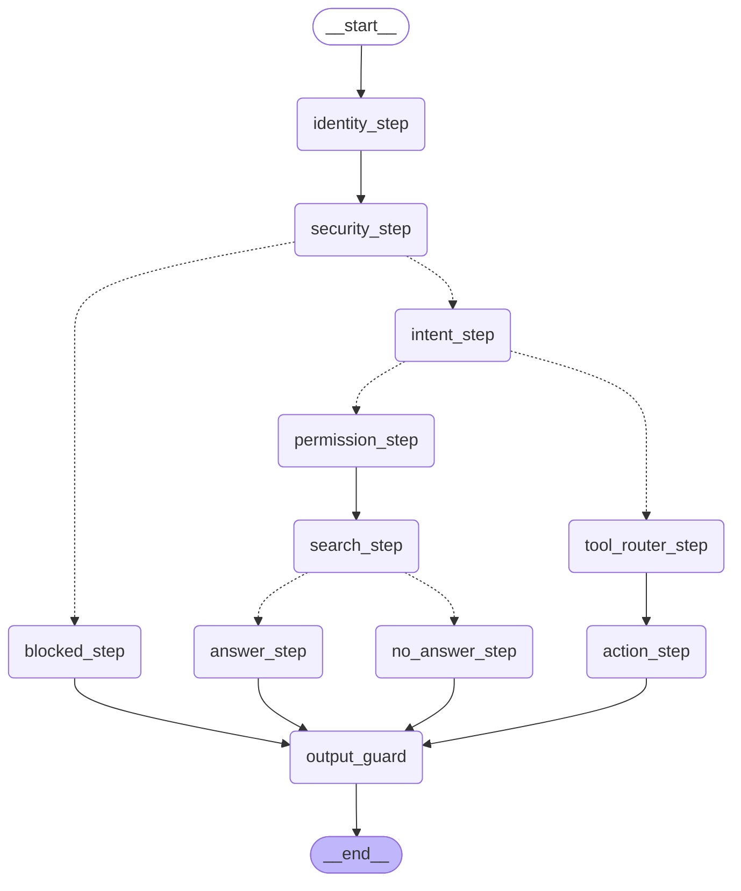

# Корпоративный AI-ассистент

Внутренний помощник компании: отвечает на вопросы по документам, выполняет
действия через реестр инструментов, соблюдает права доступа и не делает
рискованных шагов без подтверждения человека.

Написан на **Python + FastAPI + LangGraph**.

## Как устроено

Ассистент ищет ответы в документах компании семантическим поиском:
эмбеддинги считает **Google Gemini** (`gemini-embedding-001`), векторы
хранятся в Chroma. Та же модель работает ещё в двух ролях — классифицирует
намерение (вопрос или действие) и выбирает инструмент. Все обращения к
модели идут через `app/llm.py`, поэтому смена провайдера — правка одного
файла. Индекс строится при первом поиске, а не при импорте: недоступный
провайдер не роняет приложение.

Конвейер запроса собран как граф **LangGraph** — одиннадцать узлов с
развилками по безопасности, намерению и результату поиска. Каждый шаг
виден в трейсе и логируется.

## Чем это отличается от обёртки над языковой моделью

Решения здесь принимает код, а не промпт:

1. **Права проверяются до поиска, а не просьбой к модели.** Документы
   фильтруются по роли пользователя ещё до обращения к векторной базе.
   Обычный сотрудник не получит финансовый документ, потому что поиск его
   не рассматривает — а не потому, что модель согласилась не отвечать.
2. **Действия описаны реестром инструментов.** У каждого инструмента
   карточка: кто может вызывать, какой риск, что произойдёт. Нужен ли
   человек — выводится из уровня риска. Модель предлагает инструмент, но
   правила его выполнения задаёт не она.
3. **Рискованные действия останавливаются на человеке.** Граф ставит паузу,
   сохраняет состояние и ждёт подтверждения — причём от **другого**
   человека, не от автора запроса (separation of duties).
4. **Есть аварийные механизмы.** Администратор отключает сломанный
   инструмент без правки кода и деплоя; лимит частоты запросов ограничивает
   перебор и расходы на модель.
5. **Каждый шаг записан в журнал.** Кто запросил, какой инструмент выбран,
   кто подтвердил, чем закончилось — любое действие объяснимо постфактум.

Ответы при этом опираются только на найденный документ: если ответа в нём
нет, ассистент говорит об этом и предлагает следующий шаг; если документ
отвечает частично — называет, чего в нём не хватает.

## Роли

| Пользователь | Роль     | Документы           | Инструменты | Подтвердить | Kill switch |
|--------------|----------|---------------------|-------------|-------------|-------------|
| alice        | Employee | Общие               | да          | нет         | нет         |
| bob          | Manager  | Общие               | да          | да          | нет         |
| admin        | Admin    | Всё, вкл. зарплаты  | да          | да          | да          |

## Как запустить

1. Получите бесплатный API-ключ Gemini в Google AI Studio.
2. Скопируйте `.env.example` в `.env` и впишите свой ключ: `GEMINI_API_KEY=ваш_ключ`
3. Установите зависимости и запустите:

```bash
pip install -r requirements.txt
uvicorn app.main:app --reload
```

Интерактивная документация: **http://localhost:8000/docs**

## Демо

Все ключевые сценарии прогоняются одной командой. Сервер должен быть
запущен в соседнем терминале:

```bash
python demo.py
```

Скрипт показывает десять сценариев:

| № | Сценарий | Что доказывает |
|---|---|---|
| 1 | Ответ по документам с источником | RAG работает, источник виден |
| 2 | Employee спрашивает про зарплаты | документ отфильтрован по роли до поиска |
| 3 | Тот же вопрос у Admin | разница только в роли |
| 4 | «сколько **у меня** дней отпуска» | личные данные идут в инструмент |
| 5 | «сколько дней **положено**» | правило идёт в документы |
| 6 | Попытка prompt injection | блокируется до intent и до инструментов |
| 7 | Создание задачи | risk_level=high → пауза на подтверждение |
| 8 | Создатель подтверждает сам себя | 403, separation of duties |
| 9 | Подтверждает другой человек | задача создаётся, оба записаны в журнал |
| 10 | Kill switch | инструмент недоступен всем, включая Admin |

Сценарии 2, 6, 8 и 10 проверяют **отказы**. Показать, что система
отказывает правильно, важнее, чем показать, что она отвечает.

## Инструменты (tool registry)

Инструмент — одно контролируемое действие, а не «доступ к системе».
Все правила инструмента лежат в одной карточке (`app/tools.py`):

| Инструмент | Что делает | Риск | Роли | Approval |
|---|---|---|---|---|
| `create_task` | создаёт задачу в трекере | high | все | **нужен** |
| `check_vacation_balance` | остаток отпуска сотрудника | low | все | не нужен |

Ключевое решение: **approval выводится из уровня риска**, а не задаётся
для каждого инструмента отдельно.

```python
APPROVAL_REQUIRED_LEVELS = {"high", "critical"}

def tool_needs_approval(tool) -> bool:
    return tool.risk_level in APPROVAL_REQUIRED_LEVELS
```

Раньше был список рискованных действий, который надо было пополнять
руками, — и можно было завести опасный инструмент, просто забыв его
туда вписать. Теперь чтобы обойти approval, нужно **соврать про риск**,
а это осознанное действие, а не забывчивость.

Поля карточки все обязательные (нет значений по умолчанию): автор нового
инструмента не может забыть указать риск или роли — приложение упадёт при
старте. Падение на старте лучше тихой дыры в проде.

**Как модель участвует в выборе.** Узел `tool_router_step` спрашивает у
LLM, какой инструмент подходит запросу. Модель **только предлагает имя** —
между предложением и выполнением стоят четыре проверки в `action_node`:

1. существует ли инструмент в реестре (deny-by-default);
2. не выключен ли аварийно (kill switch важнее любых прав);
3. разрешён ли роли (RBAC);
4. нужен ли человек (по risk_level).

Выдуманное моделью имя инструмента не найдётся в реестре и не выполнится.

**Добавить инструмент** = дописать карточку в `TOOL_REGISTRY` и функцию
исполнения. Права, риск, порог approval, тексты отказов и попадание в
промпт маршрутизатора берутся из карточки автоматически.

## Архитектура (конвейер запроса)

```
Запрос → Лимит частоты (rate limit)          ← до графа и до трат на LLM
       → Кто пользователь (identity)
       → Проверка запроса на инъекцию (security)  ← первый рубеж
       → Определение намерения (intent): вопрос / действие
       → [вопрос]  Фильтр по правам (permissions)  ← фильтр до поиска
                 → Поиск в документах (search)
                 → Ответ по документу (LLM) / «не найдено»
       → [действие] Выбор инструмента (tool_router)
                 → 4 проверки → выполнение или пауза на подтверждение
       → Выходной guard (output_guard)  ← ЕДИНАЯ точка выхода
       → Запись в журнал (audit)
```

Обе ветки — и вопросы, и действия — сходятся в `output_guard`. Это
позволяет наращивать правила проверки исходящих данных в одном месте.

## LangGraph-граф

Прямые переходы — сплошные стрелки, развилки — пунктирные.



Диаграмма генерируется из кода, а не рисуется руками:

```bash
python -c "from app.graph import graph; print(graph.get_graph().draw_mermaid())"
```

## Структура кода

```
app/
  identity.py       — кто пользователь (заглушка SSO)
  permissions.py    — фильтр документов по роли, право на approve,
                      аварийный выключатель инструментов (kill switch)
  tools.py          — реестр инструментов: карточки, порог approval,
                      реализации (моки)
  responses.py      — шаблоны ответов и типы ответа (answer_type)
  limits.py         — лимит частоты запросов (скользящее окно)
  llm.py            — единая точка доступа к языковой модели
  search.py         — поиск по смыслу (эмбеддинги + Chroma), ленивый индекс
  retrieval.py      — защита от prompt injection
  audit.py          — журнал событий
  nodes.py          — узлы графа
  graph.py          — сборка LangGraph: узлы, рёбра, развилки, checkpointer
  graph_state.py    — AssistantState (данные, путешествующие по графу)
  data/documents.py — документы компании с метаданными доступа
  main.py           — FastAPI: /ask, /approve, /admin/tools, /audit
demo.py             — десять демо-сценариев одной командой
```

## Безопасность: слои, а не один фильтр

Ни один механизм не считается достаточным сам по себе (defense in depth):

| Слой | Где живёт | Что закрывает |
|---|---|---|
| Лимит частоты | `limits.py`, начало `/ask` | перебор формулировок, расходы на LLM |
| Проверка запроса на инъекцию | `security_node` | prompt injection во входе |
| Фильтр документов по роли | `permission_node` (до поиска) | утечка данных чужого уровня доступа |
| Проверка документов на инъекцию | `search_node` | «команды для бота» внутри документа |
| Разделение данных и инструкций | `ANSWER_PROMPT` | документ трактуется как данные, не как приказ |
| Реестр инструментов | `tools.py`, deny-by-default | выдуманный или неописанный инструмент |
| Kill switch | `permissions.py`, `/admin/tools` | сломанный инструмент — без деплоя |
| Права на инструмент | `tool_allows_role` | вызов действия не своей ролью |
| Порог approval по риску | `tool_needs_approval` | опасное действие без человека |
| Separation of duties | `/approve` | самоподтверждение |
| Выходной guard | `output_guard` | опасное содержимое в финальном ответе |
| Audit log | `audit.py` | разбор инцидента постфактум |

Ключевое: **решение принимает код, а не модель.** LLM классифицирует
намерение и предлагает инструмент, но права, риск и approval проверяются
в Python по данным из реестра.

## Типы ответов

Каждый терминальный узел помечает ответ типом (`app/responses.py`). Тип
отдаётся в HTTP-ответе и пишется в журнал событием `answer_delivered`:

| Тип | Когда |
|---|---|
| `knowledge` | ответ по документу, с источником |
| `no_source` | ответа в доступных документах нет |
| `denied` | нет прав на инструмент |
| `blocked` | заблокировано security |
| `tool_disabled` | инструмент выключен админом |
| `action_done` | действие выполнено |
| `action_rejected` | действие отклонено человеком |

Зачем: по типу считается статистика («сколько запросов упёрлось в
отказ?») и проверяется траектория на этапе evaluation («на denied-кейсе
тип обязан быть denied, а не knowledge»).

## Human-in-the-loop

Рискованные действия не выполняются автоматически. Граф ставит паузу
через LangGraph `interrupt`, сохраняет состояние (`checkpointer`) и ждёт
решения человека.

Поток: `POST /ask` → карточка + `thread_id` → `POST /approve` с этим
`thread_id` возобновляет граф.

Карточка approval собирается **из карточки инструмента** и отвечает на
пять вопросов: что за действие, каким инструментом, с какими данными,
насколько рискованно, кто запросил. Подтверждающий не должен догадываться.

Через `Command(resume={"decision": ..., "approver": ...})` в узел приходит
и решение, и личность подтверждающего — она берётся из хранилища
пользователей, а не из тела запроса. `decision` валидируется
`Literal["approve", "reject"]`; в узле действует fail-safe default: всё,
кроме явного `"approve"`, считается отказом.

## Ограничения и что дальше

- **Инструменты возвращают тестовые данные.** `create_task` и
  `check_vacation_balance` не обращаются к Jira и HR-системе. Проверяется
  весь путь запроса — выбор инструмента, права, риск, approval, журнал, —
  кроме самого сетевого вызова. Подключение реальных систем вынесено
  в слой MCP-интеграций.
- **Заголовок задачи — сырой текст запроса.** Задача называется «создай
  задачу проверить бэкапы» вместо «Проверить бэкапы». Извлечение
  параметров инструмента из запроса (structured output) не сделано.
- **Answerability check — по подстроке.** Если модель ответила «в документе
  нет ответа на этот вопрос», узел переводит ответ в тип `no_source` и
  убирает нерелевантный источник. Проверка ищет подстроку в тексте модели:
  формулировка задана промптом дословно, но это хрупко — иная формулировка
  промахнётся мимо проверки. Правильное решение — structured output с полем
  `has_answer`.
- **Ответ строится по одному документу** — берётся лучший по релевантности.
  Вопросы, ответ на которые собирается из двух policy сразу, текущая
  версия не покрывает. Reranking и объединение источников не реализованы.
- **Автопроверки groundedness нет.** Grounded-промпт снижает риск
  галлюцинаций, но не гарантирует их отсутствие; автоматическая сверка
  ответа с источником — этап evaluation. При сбое LLM узел откатывается
  на сырой текст документа (graceful degradation).
- **Состояние графа в памяти** (`InMemorySaver`). При перезапуске
  незавершённые паузы теряются; в проде — `PostgresSaver`.
- **Лимиты и kill switch тоже живут в памяти.** История запросов и
  множество отключённых инструментов — обычные объекты процесса. Два
  следствия: (1) после рестарта лимиты обнуляются, а аварийно выключенный
  инструмент молча включается обратно; (2) при нескольких воркерах
  (`uvicorn --workers N`) у каждого своё состояние, поэтому реальный лимит
  умножается на N, а выключение инструмента доходит только до одного
  процесса. В проде это Redis (лимиты) и БД (kill switch).
- **thread_id** пользователь передаёт вручную между `/ask` и `/approve`.
  В реальном UI его хранил бы фронтенд.
- **Вход (SSO)** — заглушка с тремя пользователями, без паролей и токенов.
- **Документы** хранятся в коде; в реальной версии — во внешнем хранилище
  с версионированием и ingestion-пайплайном.
- **Детектор prompt injection — по списку признаков.** Ловит очевидные
  атаки, но обходится синонимами («disregard» вместо «ignore»). Упрощение
  осознанное: за детектором стоит defense in depth — фильтр документов по
  ролям и human-in-the-loop на действиях, — поэтому одиночный промах
  детектора не открывает систему. Следующий шаг — LLM-классификатор угроз.
- **Выходной фильтр — каркас.** Все ответы проходят через `output_guard`,
  но правило пока одно: подмена текста при `security_flag`. Полноценного
  DLP (маскировка PII, вырезание чувствительных фрагментов) нет.
- **Audit log и персональные данные.** Пишутся факт события и безопасные
  метаданные, а не сырой текст запросов. Название задачи обрезается до 100
  символов, но **на PII не проверяется**. В проде нужен PII-детектор
  (regex либо библиотека уровня Presidio) и централизованный
  redaction-слой вместо redaction «по договорённости».
- **Наблюдаемости нет.** Есть журнал событий, но нет dashboard-метрик
  (latency, cost, error rate, denied requests) и отдельного `session_id`:
  запросы одной сессии между собой не связываются, связь только внутри
  одного запроса через `thread_id`.
- **Тестов нет.** Проверка сейчас — прогон `demo.py` глазами. Eval-датасет
  и автоматические проверки траектории — следующий этап.